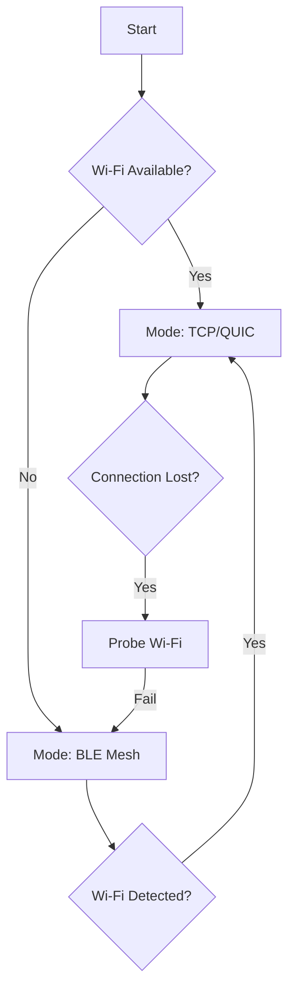

# Hybrid Transport Switching Logic (Concept)

This document outlines the architecture for the **GhostMesh Transport Switcher**, a component responsible for dynamically selecting the best available communication channel (Wi-Fi/TCP vs. Bluetooth LE) based on network conditions.

## 1. Architecture Overview

The system operates as a state machine with two primary modes:
1.  **High-Bandwidth Mode (Primary):** Uses TCP/QUIC over Wi-Fi or LAN.
2.  **Low-Bandwidth Mode (Fallback):** Uses BLE GATT characteristics for small messages.



## 2. Switching Criteria

The decision to switch transports is based on a **Connectivity Score (0-100)** calculated for each peer.

| Factor | Weight | Description |
| :--- | :--- | :--- |
| **Ping Latency** | 40% | RTT > 500ms degrades score. |
| **Packet Loss** | 30% | Missed heartbeats reduce score. |
| **Interface State** | 30% | Is the Wi-Fi interface up? |

*   **Score > 50:** Use TCP/QUIC.
*   **Score < 50:** Fallback to BLE.

## 3. Implementation Strategy

### A. The `TransportManager` Struct
A new Rust struct that wraps the `libp2p::Swarm` and the `BleService`.

```rust
struct TransportManager {
    swarm: Swarm<MyBehaviour>,
    ble: BleService,
    peer_states: HashMap<PeerId, TransportState>,
}

enum TransportState {
    Tcp(Multiaddr),
    Ble(BleAddress),
}
```

### B. Message Routing
When sending a message (e.g., `/log Hello`), the `TransportManager` checks the destination peer's state:

1.  **If TCP:** Send via `gossipsub` (standard).
2.  **If BLE:**
    *   Fragment the message (BLE MTU is small, ~20-512 bytes).
    *   Write to the peer's GATT Characteristic.
    *   Wait for Write Response.

### C. BLE Gossip (Flooding)
Since BLE doesn't support `gossipsub` natively, we implement a simple "Flood" protocol:
*   Node A receives a message via BLE.
*   Node A checks if it has seen this Message ID.
*   If new, Node A re-broadcasts it to all connected BLE peers.

## 4. Challenges & Mitigations

*   **Bandwidth:** BLE is slow. **Mitigation:** Only sync critical CRDT headers, not full logs. Request full sync only when Wi-Fi returns.
*   **Battery:** Scanning drains battery. **Mitigation:** Use "Windowed Scanning" (scan for 5s every 60s) when in fallback mode.
*   **Security:** BLE is easier to sniff. **Mitigation:** All payloads must be encrypted with the same Noise Protocol keys used in TCP.
